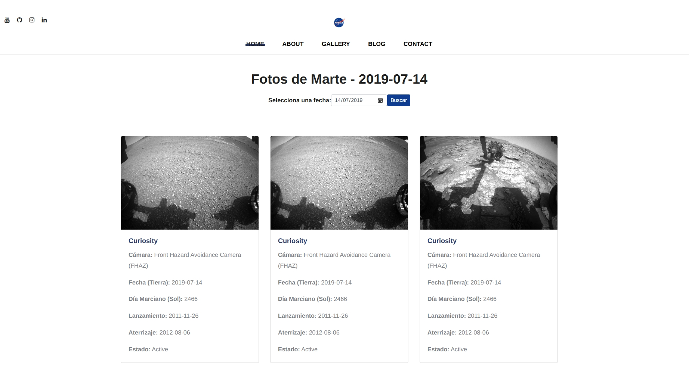

# 🚀 NASA Mars Rover Photos Viewer

Este proyecto es una aplicación web desarrollada con **Django** y **Bootstrap** que permite visualizar las fotos tomadas por los rovers de la NASA en Marte, utilizando la [NASA Mars Rover Photos API](https://api.nasa.gov/).

## 🌐 Funcionalidades

- Buscar fotos por fecha (`earth_date`)
- Mostrar imágenes en formato de tarjetas (cards) responsivas
- Visualizar información del rover y la cámara
- Previsualización en pantalla completa con Fresco Lightbox
- Diseño responsivo con Bootstrap 5

## 🛠️ Tecnologías

- Python 3
- Django
- Bootstrap 5
- HTML/CSS
- [NASA API](https://api.nasa.gov/)
- Fresco.js para lightbox

## 📸 Ejemplo visual

## 🚀 Instalación
git clone https://github.com/tu-usuario/nasa-mars-viewer.git
cd nasa-mars-viewer
